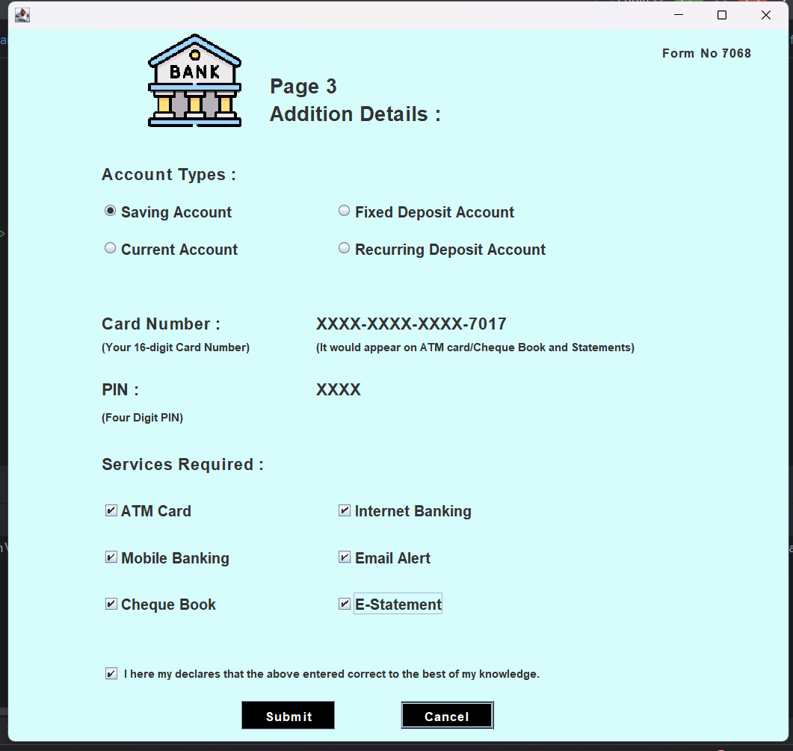
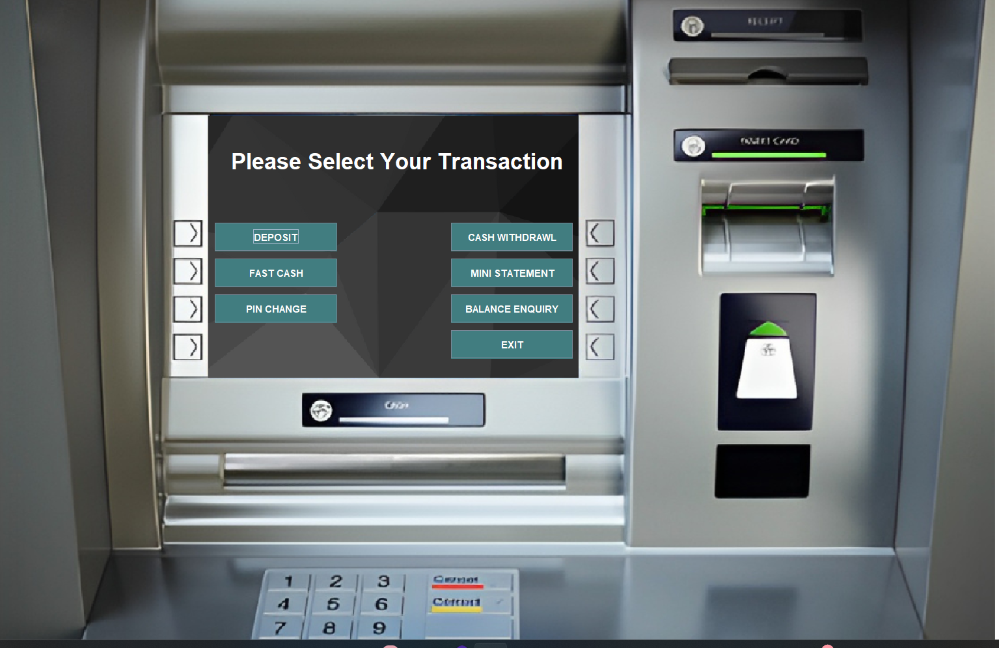
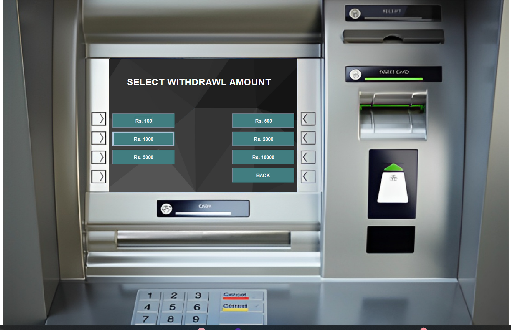

# **Bank Management System (ATM Simulation) 🏦**  

A **Java-based ATM simulation** built using **Swing, AWT**, and **SQL (JDBC)** for seamless banking operations. This project provides an interactive user interface for secure transactions, including deposits, withdrawals, balance inquiries, and PIN management.  

## **Features 🚀**  
✔️ **User Authentication** – Secure login with card number and PIN.  
✔️ **Deposit & Withdrawal** – Supports standard and fast cash withdrawal options.  
✔️ **Balance Inquiry** – Displays real-time account balance.  
✔️ **Mini Statement** – Shows the last few transactions.  
✔️ **PIN Change** – Allows users to update their PIN securely.  
✔️ **Database Integration** – Uses **SQL (JDBC)** to manage account data.  

## **Technologies Used 🛠️**  
- **Programming Language:** Java  
- **GUI Frameworks:** Swing, AWT  
- **Database:** MySQL (via JDBC)  

## **Setup Instructions 🔧**  
1. Clone the repository:  
   ```bash
   git clone https://github.com/bhavsarhardeep/Bank-Management-System.git
   ```  
2. Import the project into your **Java IDE (Eclipse/IntelliJ IDEA)**.  
3. **Create and set up the MySQL database:**  
   - Open MySQL and run the following commands:
     ```sql
     CREATE DATABASE bank_management;
     USE bank_management;
     
     CREATE TABLE login (
         cardno VARCHAR(20) PRIMARY KEY,
         pin VARCHAR(10) NOT NULL,
     );
      CREATE TABLE signup (
         form_no VARCHAR(20),
         name VARCHAR(20),
         father_name VARCHAR(20),
         DOB VARCHAR(20),
         gender VARCHAR(20),
         email VARCHAR(20),
         marital_status VARCHAR(20),
         address VARCHAR(20),
         city VARCHAR(20),
         pin VARCHAR(20),
         state VARCHAR(20),
     );
      CREATE TABLE signuptwo (
         form_no VARCHAR(20),
         religion VARCHAR(20),
         category VARCHAR(20),
         income VARCHAR(20),
         educational VARCHAR(20),
         occupation VARCHAR(20),
         pan VARCHAR(20),
         aadhar VARCHAR(20),
         seniorcitizen VARCHAR(20),
         existingaccount VARCHAR(20),
     );
      CREATE TABLE signupthree (
         form_no VARCHAR(20),
         accounttype VARCHAR(20),
         cardno VARCHAR(20),
         pin VARCHAR(20),
         servicerequired VARCHAR(20),
     );
      CREATE TABLE bank (
         pin VARCHAR(20),
         date VARCHAR(20),
         type VARCHAR(10),
         date VARCHAR(20),
     );
     ```  
4. Run the `login.java` file to launch the application.  
5. Navigate to the **Sign Up** section and create a new account.  
6. Log in using your credentials to access the system.   

## **Screenshots 📸**  

  
 
 
 
 
 
 
 
 
  

## **License 📜**  
This project is licensed under the **MIT License**.  

---
